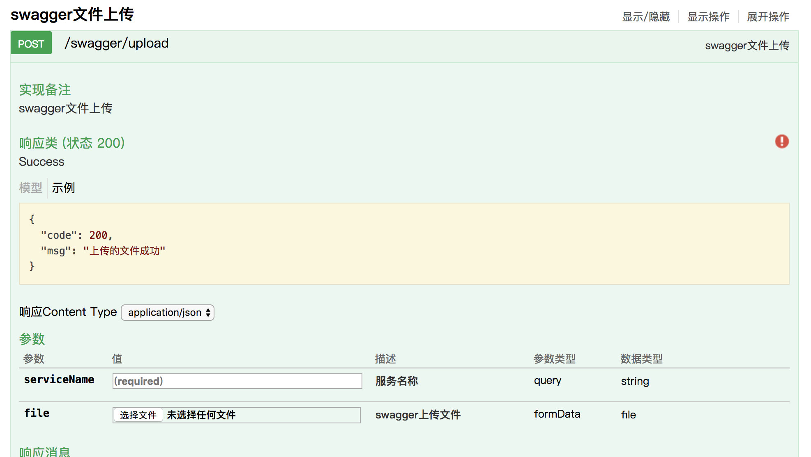
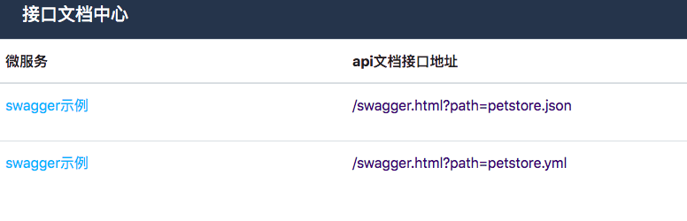
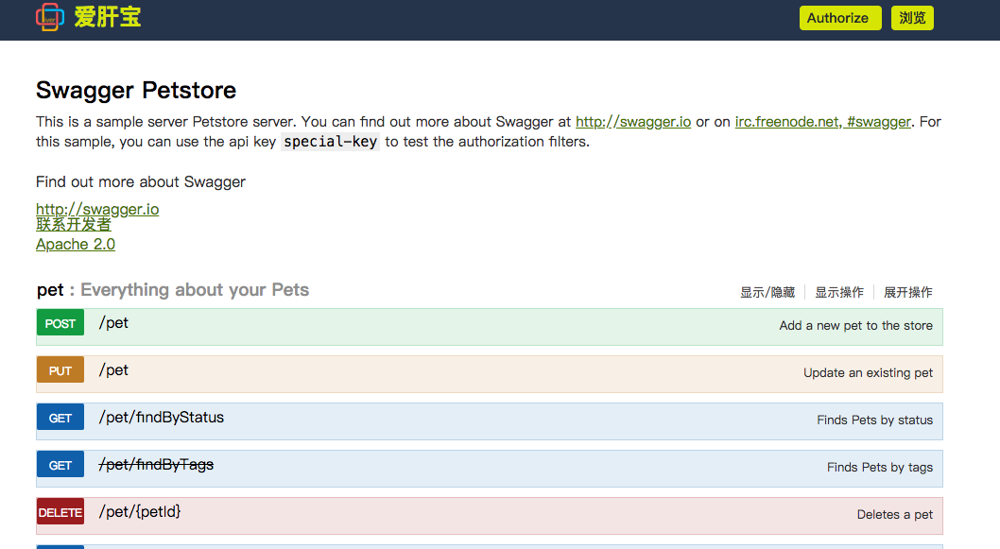

go-swagger
=================
go语言实现api文档中心管理


### 安装

```bash
go  get -u -v github.com/aiganbao/go-swagger
```

### go-swagger


```bash
go-swagger -h:
  -a string
    	请输入服务端地址 (default ":8083")
  -t string
    	请输入服务端token值 (default "9a8ecfd2f0a1ea11fc577e40")
```


### 如何使用

1. 编辑`swagger/meta.json`

增加你自己的api定义文件同时把api定义文件放到目录`swagger`下:

`swagger/meta.json`

```json
[
  {
    "name": "swagger文档管理",
    "href": "/swagger.html?path=swagger.yml"
  },
  {
    "name": "swagger示例",
    "href": "/swagger.html?path=petstore.json"
  },
  {
    "name": "swagger示例",
    "href": "/swagger.html?path=petstore.yml"
  }
]
```


2. 启动服务`go-swagger`
 
打开链接
```bash
http://127.0.0.1:8083/

```

3. 也可以通过后台管理接口上传swagger文件




### 效果图如下:







### 参考链接

* [swagger](https://swagger.io/)
* [Swagger Editor](http://editor.swagger.io/#/)